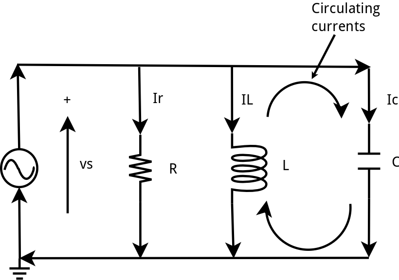
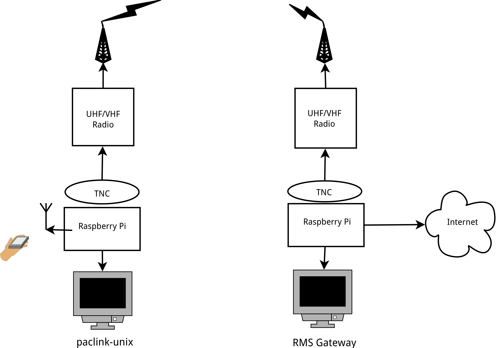
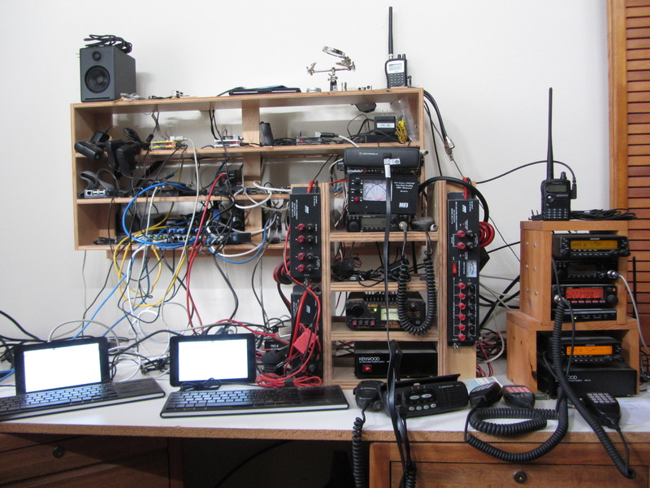

#HSLIDE

## Winlink & the Raspberry Pi
###### Basil Gunn  N7NIX,  last edit April 10, 2017
###### https://gitpitch.com/nwdigitalradio/Winlink4LInux
######https://github.com/nwdigitalradio/Winlink4Linux

#HSLIDE

## Take Away - in case you fall asleep
* Raspberry Pi is a cool little device that doesn't take much power.
* More HAM digital infrastructure is a good thing.
* You can get all software & presentations from github at no cost.

#VSLIDE

#HSLIDE

## What is Winlink
* Radio messaging system administered by volunteers that uses HAM radio frequencies.
* Takes SMTP compliant e-mail messages and using B2 Forwarding Protocol transports them via:
  * Amateur radio
  * Telnet

#HSLIDE

## Winlink components

* CMS - Common Message Server
  * maintained by Winlink
* RMS - Radio Mail Server
  * maintained by you
* Client e-mail message mangler

#HSLIDE

## Why the Raspberry Pi?

* Raspberry Pi 3 power draw:
  * 1.4 W  idle
  * ~3.7 W  under heavy load
  * https://www.pidramble.com/wiki/benchmarks/power-consumption

* Runs Linux
  * Has decent uptime
  * You can control system updates
  * Built in WiFi for connecting to Winlink device

#HSLIDE

## Hardware Components

* Some TNC or sound card
  * Prefer a HAT for hardware integration, fewer cables
  * HAT = **H**ardware **A**ttached on **T**op

* Power supply or battery with trickle charger

* Ethernet or WiFi connection to the Internet
  * RMS Gateway only

#VSLIDE

#### Hardware Components - continue

* Some device (workstation, laptop, pad, phone) for:

  * running message composition & reception.
  * console to maintain gateway/paclink-unix

* Some HF/VHF/UHF Amateur Radio.

#VSLIDE

#VSLIDE

#### Shameless plug for a good Sound Card

* The NW Digital radio UDRC II has:
  * two separate data channels (stereo sound device)
  * two GPIO ports to control PTT
  * two data connectors for radio data ports.
  * flexible data rate 1200, 9600, ->

##### Example

* Connect both 2M Kenwood & 220 Alinco
  * No switch required
  * Use WiFi on RPi to connect to Winlink device.

#HSLIDE
## Software Components
* Depends on functionality

  * Winlink RMS Gateway
  * Linux Winlink message client
  * TNC for Windows Winlink msg client

#VSLIDE

#### Software Components - continued
###### assume sound card

* Direwolf

* AX.25

* Linux RMS Gateway

* paclink-unix

* Something to compose & read e-mail messages

#VSLIDE

#### Need something to compose/receive messages

* 4 ways to do this:
  * Use paclink-unix & an e-mail client on the RPi
    * mail, mutt, Thunderbird (need keyboard & screen)
  * Use paclink-unix with a mail server, use any external e-mail client
  * Use paclink-unix with a mail server & web server with web e-mail client
  * Forget paclink-unix & connect to Direwolf with AGWPE or Network Kiss interface.

#VSLIDE

#### compose/receive messages - continued
#### AGWPE / Network Kiss

* Network (virtual) winlink app that supports either:
  * AGWPE network protocol (port 8000)
  * Network Kiss (port 8001)

##### Windows based applications include:

* Outpost, AirMail, Paclink, Winlink Express

#VSLIDE

## Direwolf

* **D**ecoded **I**nformation from **R**adio **E**missions for **W**indows **O**r **L**inux **F**ans
* Dire Wolf is a software "soundcard" modem/TNC and APRS encoder/decoder.
* Source: https://github.com/wb2osz/direwolf

#VSLIDE

## AX.25

* AX.25 (Amateur X.25) is a data link layer protocol derived from the X.25 protocol suite
* Designed for use by amateur radio packet operators
* Protocol is built into Linux kernel
* Also has these user side components
  * ax25tools
  * ax25apps
  * libax25

#VSLIDE

## Linux RMS Packet Gateway

* A radio station running Radio Mail Server (RMS) Packet software which provides a communications path between
 a VHF or UHF packet Winlink user and the internet via a Winlink Common Message Server (CMS)

#VSLIDE

#### Linux RMS Packet Gateway - continue

*  Winlink has expectation that you run your RMS Gateway 24/7.

* Written (10/2004) & maintained by:
  * Hans-J. Barthen - DL5DI
  * Brian R. Eckert - W3SG

#VSLIDE

### Linux RMS Gateway Installation

* Great notes from Brian Eckert W3SG
  * http://k4gbb.no-ip.org/docs/rmsinstdoc.html

* Script that will install both RMS Gateway and/or paclink-unix
  * https://github.com/nwdigitalradio/n7nix

#VSLIDE

## paclink-unix

* paclink-unix is a UNIX client for the Winlink 2000 ham radio email system.

* Written by:
  * Nick Castellano - N2QZ (2005)
  * Dana Borgman - KA1WPM
  * Basil Gunn - N7NIX (2009)

#VSLIDE

### paclink-unix - composing & reading messages

* Enables composing/reading of Winlink messages using most email clients
  * mutt is a great text based email client.
* I use k9-mail (https://k9mail.github.io/) on Android Nexus 7 tablet
* Supports most/all email clients that have IMAP support.
  * Internet Message Access Protocol is an Internet standard protocol used by e-mail clients to retrieve e-mail messages from a mail server over a TCP/IP connection.

#VSLIDE

### paclink-unix - transports

* Uses 3 programs for different transport paths
  * wl2kax25 for sending/receiving using a radio connected to an RMS
  * wl2ktelnet for sending/receiving using Internet
  * wl2kserial for send/receiving using a Pactor modem

#HSLIDE

##### Lotsa RPi's & Radios

#VSLIDE

##### Just the RPi's

#HSLIDE

## Resources

##### paclink-unix
* source code: https://github.com/nwdigitalradio/paclink-unix
* presentation: https://gitpitch.com/nwdigitalradio/paclink-unix/

##### Linux RMS Gateway
* source code: https://github.com/nwdigitalradio/paclink-unix
* presentation: https://gitpitch.com/nwdigitalradio/rmsgw/

#VSLIDE

##### Installation Scripts
* https://github.com/nwdigitalradio/n7nix

##### Forums
* https://groups.yahoo.com/neo/groups/paclink-unix/
* https://groups.yahoo.com/neo/groups/LinuxRMS/
* https://nw-digital-radio.groups.io/g/udrc/

##### This presentation
* https://gitpitch.com/nwdigitalradio/Winlink4Linux
* Files used to generate this presentation:
  * https://github.com/nwdigitalradio/Winlink4Linux/
